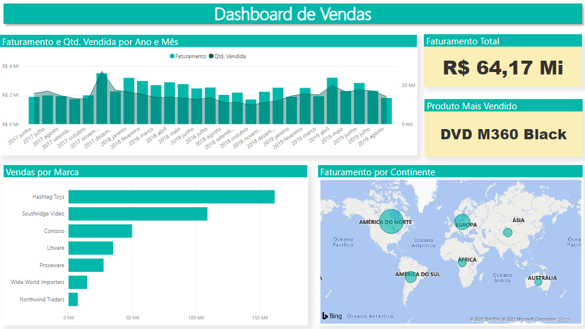
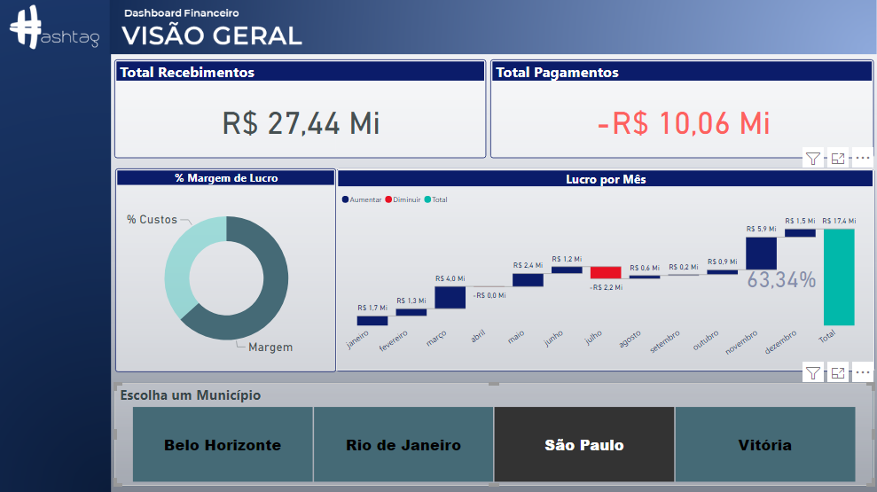
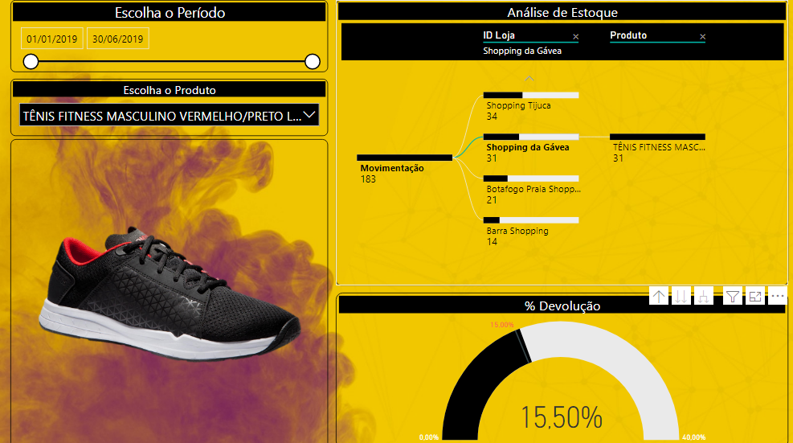
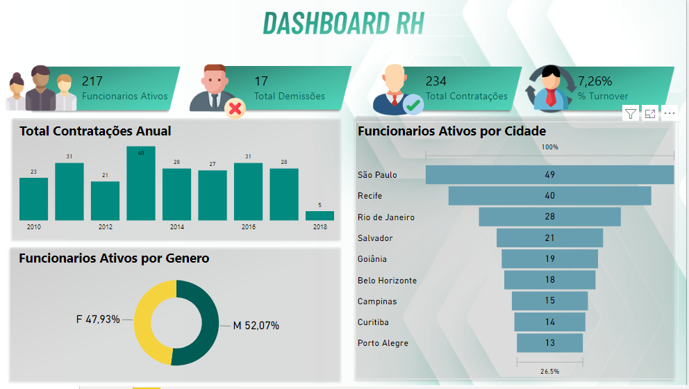

# 📊 Portfólio Power BI

Repositório contendo dashboards desenvolvidos em Power BI com foco em:

- Visualização de Dados
- Business Intelligence
- KPIs Estratégicos
- Storytelling com Dados
- Modelagem de Dados
- DAX
- Power Query

---

# 🧩 Dashboards

## 📈 Dashboard de Vendas

Análise de faturamento, quantidade vendida, produtos e distribuição geográfica das vendas.

### Indicadores:
- Faturamento Total
- Produto Mais Vendido
- Vendas por Marca
- Faturamento por Continente
- Evolução Temporal das Vendas

---

## 💰 Dashboard Financeiro

Dashboard financeiro voltado para análise de receitas, despesas e margem de lucro.

### Indicadores:
- Total de Recebimentos
- Total de Pagamentos
- Margem de Lucro
- Lucro por Mês
- Análise por Município

---

## 📦 Dashboard de Estoque

Dashboard para controle e monitoramento de estoque e movimentações de produtos.

### Indicadores:
- Movimentação de Estoque
- Taxa de Devolução
- Análise por Produto
- Análise por Loja
- Filtros Temporais

---

## 👥 Dashboard RH

Dashboard voltado para análise de indicadores de Recursos Humanos.

### Indicadores:
- Funcionários Ativos
- Contratações
- Demissões
- Turnover
- Funcionários por Cidade
- Distribuição por Gênero

---

# 🛠 Tecnologias Utilizadas

- Power BI
- DAX
- Power Query
- Excel
- Modelagem de Dados
- ETL
- Data Visualization

---

# 🎯 Objetivo

Demonstrar habilidades em:

- Desenvolvimento de Dashboards
- Criação de KPIs
- Business Intelligence
- Transformação de Dados
- Storytelling com Dados
- Análise Exploratória

---

## 👨‍💻 Autor

Robert Melo

🔗 LinkedIn: https://www.linkedin.com/in/robertdemelo/ 
🐍 Python | IA | Machine Learning | LangChain | Data Science